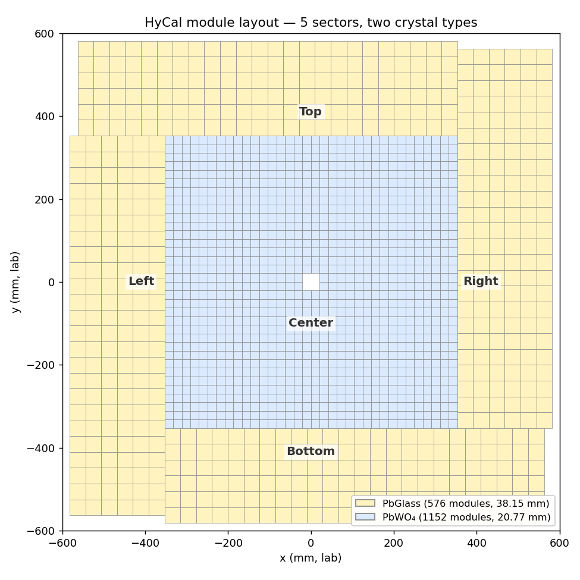
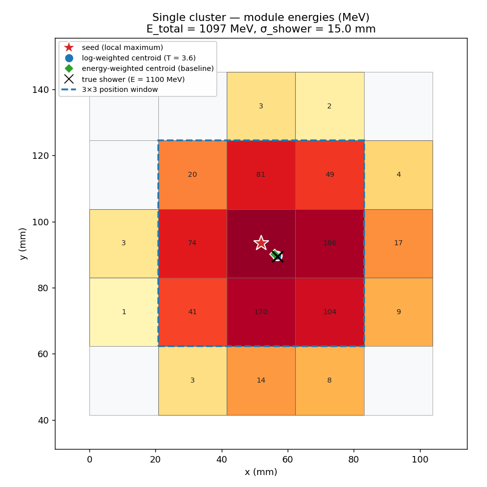
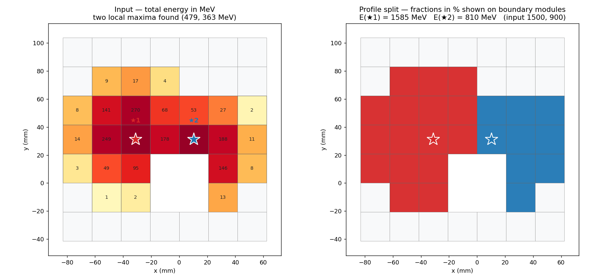
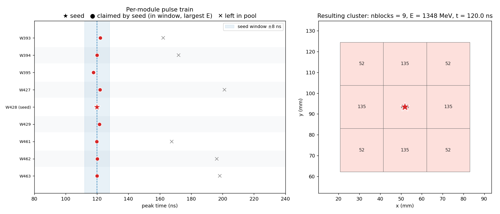
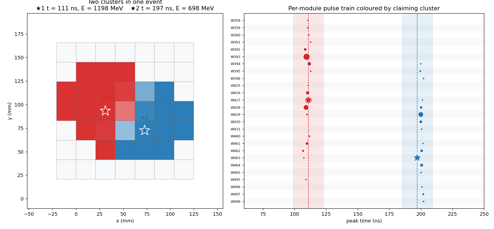
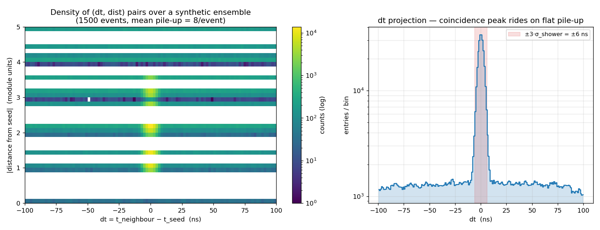
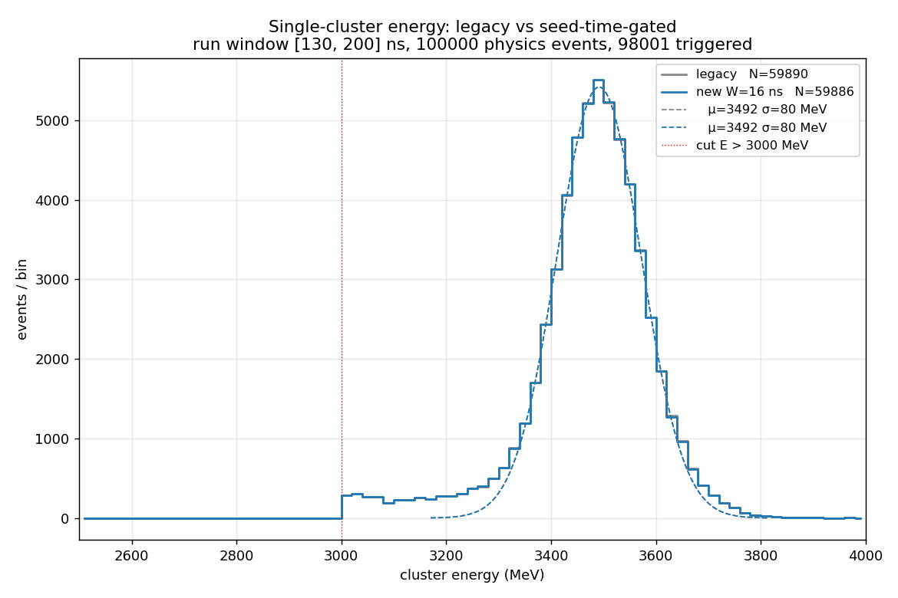
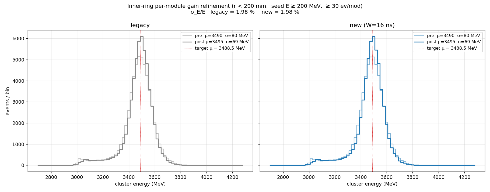
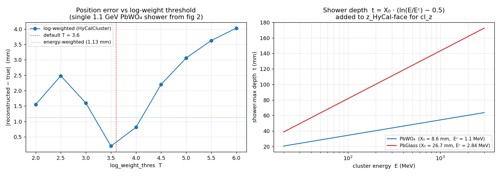

# HyCal Clustering in `prad2det`

**Author:** Chao Peng (Argonne National Laboratory)

`fdec::HyCalCluster` (in [`prad2det/include/HyCalCluster.h`](../../../prad2det/include/HyCalCluster.h))
implements the *Island* clustering algorithm originally developed for
PRad-I (`PRadIslandCluster` / `PRadHyCalReconstructor` in
PRadAnalyzer) and ported here to operate on the index-based
`HyCalSystem` geometry. It groups adjacent above-threshold modules,
splits multi-maximum islands using a transverse shower profile, and
reconstructs each cluster's transverse position with a log-weighted
centroid. PRad-II FADC waveform data calls for one further capability
absent from the PRad-I lineage: a single channel can produce more than
one pulse per event, and physically distinct showers can land on
overlapping module sets at different times. Section
[Multi-pulse extension](#multi-pulse-extension-seed-anchored-timing-coincidence)
extends the algorithm to handle that case while preserving the
single-pulse semantics for legacy callers.

## HyCal geometry

HyCal is a hybrid sandwich calorimeter: an inner $\sim$700 × 700 mm²
PbWO₄ matrix surrounded by a PbGlass ring. Modules sit on a
pixel-perfect grid within each of five sectors (Center, Top, Right,
Bottom, Left); the inter-sector boundary is a known geometric step in
module size handled by the `HyCalSystem::qdist()` quantised-distance
helper.



| sector | crystal | module size (mm) | count |
|---|---|---:|---:|
| Center | PbWO₄ | 20.77 × 20.75 | 1152 |
| Top + Right + Bottom + Left | PbGlass | 38.15 × 38.15 | 576 (total) |

`HyCalSystem` builds an O(1) per-sector grid plus a precomputed
cross-sector neighbour list at `Init()` time, so the per-event hot path
never re-parses the geometry JSON nor recomputes adjacency.

## Notation

Throughout this note we denote

- $\mathcal{H}$ — the set of **module hits** added in one event via
  `AddHit(idx, E, t)`. Each hit $h \in \mathcal{H}$ carries a module
  index, a calibrated energy $E_h$ in MeV, and a peak time $t_h$ in ns.
  More than one hit on the same module is permitted (see
  [Multi-pulse extension](#multi-pulse-extension-seed-anchored-timing-coincidence));
  for legacy callers $|\{h : \mathrm{idx}(h) = m\}| \le 1$.
- $\mathcal{N}(m)$ — the set of HyCal modules adjacent to module $m$.
  `HyCalSystem::for_each_neighbor` enumerates this in O(8 + k) where
  $k \le 3$ is the number of cross-sector neighbours.
- $G$ — a *group*, i.e. a connected island of hits constructed by the
  algorithm and partitioned by the splitter into one or more clusters.
- $E_T$ — `min_center_energy`, the seed energy threshold (default
  10 MeV).
- $E_M$ — `min_module_energy`, the per-hit energy threshold applied at
  ingestion (default 0 MeV — no cut by default; setting it small is
  recommended for noisy data).
- $E_C$ — `min_cluster_energy`, the cluster acceptance threshold
  (default 50 MeV).

## Single-pulse algorithm

The original PRad-I algorithm operates on $\mathcal{H}$ with one hit
per module and runs in four steps.

### Step 1 — Seed-driven island growth

Hits are sorted by $E_h$ in descending order. Walking the sorted list,
the algorithm picks the largest unconsumed hit satisfying $E_h \ge E_T$
as a *seed* and grows a connected component via breadth-first traversal
through $\mathcal{N}(\cdot)$. Each visited hit is marked consumed so it
cannot seed a second component. Sub-threshold ($E_h < E_T$) hits are
never seeds but are still pulled into the group through the BFS, so the
group eventually contains every hit reachable from the seed by
edge-sharing adjacency. Setting `corner_conn = true` (default `false`)
adds diagonal neighbours during traversal, which can help very narrow
showers but tends to merge accidentally close clusters.

This pass produces a list of disjoint groups
$\{G_1, G_2, \ldots\}$ ordered by descending seed energy.

### Step 2 — Local maxima

Within each group, `find_maxima()` retains the hits that are
*strictly* greater than every grid neighbour (corners always included
in the maximality test, regardless of `corner_conn`) AND satisfy
$E_h \ge E_T$. Single-maximum groups produce one cluster directly;
multi-maximum groups proceed to Step 3.

### Step 3 — Profile-based split

When a group $G$ contains $K > 1$ local maxima
$\{m_1, \ldots, m_K\}$, the shared modules' energies must be
partitioned. The splitter

1. **Initialises** the per-maximum, per-hit fractions
   $f^{(0)}_{ji} = p(d_{ji})\,E_{m_i}$, where $p(d)$ is the transverse
   shower profile (see `IClusterProfile`) evaluated at the quantised
   module distance $d_{ji}$ between hit $j$ and maximum $m_i$.
2. **Iterates** for `split_iter` passes (default 6). On each pass it
   computes the provisional centroid of every maximum from the 3 × 3
   neighbourhood weighted by the current normalised fractions
   $\hat{f}_{ji} = f_{ji} / \sum_i f_{ji}$, and updates
   $f_{ji} = p(\lvert h_j - \mathbf{c}_i\rvert)\,E_{\mathrm{tot},i}$
   against that centroid.
3. **Emits** the clusters: hits with normalised fraction below
   `least_split` (default 1 %) are dropped from the corresponding
   cluster; surviving hits enter with energy $\hat{f}_{ji}\,E_{h_j}$.
   Any hit shared by two clusters causes both to receive the `kSplit`
   flag.

### Step 4 — Position reconstruction

For every accepted cluster, `reconstruct_pos()` recomputes the
transverse position via a **log-weighted** centroid:

$$
w_h \;=\; \max\!\bigl(0,\; T + \ln(E_h / E_{\mathrm{cluster}})\bigr),
\qquad
\hat{x} \;=\; x_{\mathrm{seed}} \;+\;
\frac{\sum_h w_h\,\Delta x_h}{\sum_h w_h}\;s^{(x)}_{\mathrm{seed}},
$$

with $\Delta x_h = (x_h - x_{\mathrm{seed}})/s^{(x)}_{\mathrm{seed}}$
in module units and $T = $ `log_weight_thres` (default 3.6). Only
hits within the seed's 3 × 3 grid neighbourhood contribute (capped at
`POS_RECON_HITS = 15`). The threshold $T = 3.6$ corresponds to a cut
$E_h / E_{\mathrm{cluster}} < e^{-T} \approx 2.7\,\%$, which suppresses
long shower tails and noise-driven hits while letting the dominant
3 × 3 modules dictate the position. Section
[Parameter sensitivity](#parameter-sensitivity) shows that this choice
sits at the bottom of the position-error well.

### Worked example — single cluster

A 1.1 GeV photon shower placed at (56.92, 89.38) mm with
$\sigma_{\mathrm{shower}} \approx 15\,\mathrm{mm}$ (Molière radius for
PbWO₄ is $\sim$20 mm, so most of the energy lies in the central
3 × 3) is fed to `HyCalCluster`. The figure was produced by driving
the production C++ implementation through `prad2py.det` — the only
Python-side mathematics is the synthetic shower input and one explicit
energy-weighted baseline included for comparison.



| quantity | value |
|---|---:|
| seed module (W428) | (51.92, 93.38) mm |
| 19 grouped modules, $E_{\mathrm{cluster}}$ | 1098 MeV |
| true position | (56.92, 89.38) mm |
| energy-weighted (baseline) | (56.04, 90.07) mm — 1.13 mm error |
| log-weighted ($T = 3.6$) | (56.88, 89.60) mm — 0.23 mm error |

Two observations. First, the seed module is *not* the true shower
position — the seed always lands on a module centre, while the actual
shower is offset within the module; position reconstruction's job is
to recover the offset from the energy sharing between neighbours.
Second, the log-weighted centroid is $\sim 5 \times$ closer to truth
than the energy-weighted centroid, because the linear weighting gives
non-trivial weight to modules carrying $< 5\,\%$ of the energy and
their position uncertainty pulls the reconstructed point toward the
sampling-cell centres.

### Worked example — two-shower split

Two showers (1500 MeV at $(-25, +5)$ mm, 900 MeV at $(+25, -8)$ mm)
drop into a single connected island. The seed-driven BFS returns one
group of $\sim$25 modules with two local maxima.



The left panel shows the input total energy per module (MeV); the two
local maxima ★1 / ★2 are clearly separated by $\sim$3 modules. The
right panel shows each module's dominant cluster (red = ★1, blue = ★2)
with alpha proportional to the dominance fraction. Recovered cluster
energies are 1585 / 810 MeV against the injected 1500 / 900 MeV
($+5.7\,\% / -10.0\,\%$ bias), characteristic of the simple analytical
profile in `SimpleProfile` — a higher-fidelity profile (e.g. one
tabulated from MC) reduces this systematic. The `kSplit` flag is set
on both resulting clusters so downstream code can apply a leakage
correction or weight them differently.

## Multi-pulse extension: seed-anchored timing coincidence

PRad-II FADC waveform data routinely produces more than one pulse per
module per event: ordinary pile-up, accidental coincidences, and
out-of-time backgrounds all add to the per-channel pulse train.
Two consequences for the original Island clustering:

1. *Selection at the channel level is lossy.* Picking a single best
   pulse per module before clustering — by integral or by a fixed
   timing window — discards the information needed to recover
   physically distinct showers that share modules at different times.
2. *Time information is needed at the cluster level.* Even when only
   one shower is present in an event, gating the island growth on a
   timing coincidence with the seed sharply rejects out-of-time
   neighbours that the spatial-only algorithm would otherwise pull in.

The extension keeps the four-step structure above intact and
generalises Step 1 only.

### Generalised seed-driven BFS

Given a seed hit $h_s$ with energy $E_s$ and time $t_s$, the BFS
visits every hit reachable through $\mathcal{N}(\cdot)$. For each
neighbour module $m \in \mathcal{N}(\mathrm{idx}(h_s))$ — and
recursively, every neighbour of subsequently added hits — the
algorithm now selects at most one hit on $m$ to add to the current
group: the **largest-energy** unconsumed hit $h^\star$ on $m$ whose
peak time satisfies

$$
\bigl\lvert t_{h^\star} - t_s \bigr\rvert \;\le\; W,
\qquad W \;=\; \texttt{seed\_time\_window}.
$$

Setting $W \le 0$ disables the gate and recovers the original
single-pulse behaviour exactly.

The largest-energy rule is preferred over a nearest-in-time rule
because peak-time uncertainty grows as $\sigma_t \propto 1/\mathrm{S/N}$:
small pulses have noisy time stamps, and tying the assignment to time
proximity would let a low-energy noise pulse outvote the genuine
shower contribution when both fall inside the window. The largest-energy
rule degenerates to the nearest-in-time rule precisely when the
shower-physics signal dominates the per-channel content, which is the
regime of interest.

Hits not selected — either because their module already has a larger
in-window candidate or because they fall outside $\pm W$ — remain in
the pool. After `find_maxima` + the splitter run on the current group
(Steps 2–4 unchanged), the algorithm returns to the sorted seed list
and picks the next-largest unconsumed hit. The result is naturally
multi-cluster: a single event can produce one cluster per distinct
shower time, each with its own time-coincident constituents.

### Demonstration — coincidence on a 3 × 3 island

Figure 5 illustrates the gate. A 600 MeV seed at $t = 120$ ns is
surrounded by eight neighbours; on each neighbour we synthesise
(a) a real shower contribution at $t \approx 120$ ns
($\sigma_t = 1.5$ ns) and (b) a low-energy out-of-time background
pulse drawn from $\mathcal{U}(160, 220)$ ns. Running `HyCalCluster`
with $W = 8$ ns:



The left panel shows the per-module pulse train: the in-window real
pulses (●) are claimed by the seed and contribute to the cluster,
while the out-of-window background pulses (✕) remain in the pool.
The right panel shows the resulting nine-module cluster with the
shared seed time. None of the discarded background pulses pass the
$E_T$ threshold to seed clusters of their own here, so the event
yields exactly one cluster.

### Demonstration — two clusters at different timings

Figure 6 doubles up the input: a 1200 MeV shower at $t = 110$ ns and
a 700 MeV shower at $t = 200$ ns landing on overlapping module sets
in the same event. With $W = 12$ ns, the algorithm produces two
clusters:



The left panel colour-codes each module by its dominant cluster (red
for ★1 at $t = 111$ ns, blue for ★2 at $t = 197$ ns) with alpha
proportional to the dominance fraction. The right panel shows the
per-module pulse train with both coincidence windows shaded — pulses
inside the first window are claimed by ★1, pulses inside the second
window are subsequently claimed by ★2, and the seeds appear as stars
at their respective row + time. The shared modules carry one pulse
in each window; each pulse is consumed exactly once, by the seed whose
window it falls in.

### Choosing $W$ from real data — `CollectNeighborTiming`

Setting $W$ to a sensible value requires looking at the actual dt
distribution between candidate seeds and their spatial neighbours.
`HyCalCluster::CollectNeighborTiming(out, max_qdist)` performs that
study without applying any timing cut and without consuming pulses
across seeds:

1. Identify seed candidates by the same energy-descending rule as
   `FormClusters`, but with each seed claiming only the same-module
   pulses inside a tight $\pm 5$ ns window so a single physics shower
   doesn't generate redundant seed entries.
2. For each seed, scan every other hit within $\lvert dx_q\rvert,
   \lvert dy_q\rvert \le \mathtt{max\_qdist}$ on the module grid and
   emit one `SeedNeighborTiming` row per pair, recording $(dt, dx_q,
   dy_q, E_s, E_h)$.

The Python tool
[`analysis/pyscripts/study_hycal_timing.py`](../../../analysis/pyscripts/study_hycal_timing.py)
drives this against EVIO data and writes a flat TSV/CSV. The expected
shape of the output — a coincidence peak at $dt \approx 0$ riding on a
flat pile-up background — is shown synthetically in figure 7
(1500 events, mean of 8 random pile-up pulses per event):



The left panel is the joint $(dt, |\mathbf{r}|)$ density on a log scale;
horizontal stripes at integer plus $\sqrt{2}$ module units are the
discrete spatial structure of the grid. The right panel is the dt
projection: the coincidence peak (RMS $\sim 2$ ns in this synthetic
sample, dominated by the simulated shower-time jitter) sits two
orders of magnitude above the flat pile-up. A natural choice is
$W \approx 3 \cdot \sigma_{\mathrm{peak}}$ — wide enough to capture
the real signal, narrow enough that the pile-up integral inside the
window is much smaller than the signal.

### Backwards compatibility

When `seed_time_window` $\le 0$ (the default) and callers continue to
add at most one hit per module, the generalised BFS reduces to the
original Step 1 by construction:

- The per-neighbour selection picks the unique unconsumed hit on each
  neighbour module.
- The seed-driven order over a sorted hit list visits every connected
  component exactly once, in the same set as a per-component DFS.
- Sub-threshold modules participate in the group without seeding.

Existing analyses that pass $t = 0$ for every hit are therefore
unaffected.

## Validation on PRad-II beam data

To verify that the timing-coincidence path neither distorts well-formed
clusters nor invents new ones, we run both code paths on the same EVIO
input and compare a clean physics observable: the cluster energy spectrum
of single-cluster events with $E_{\mathrm{cluster}} > 3$ GeV.
[`analysis/pyscripts/benchmark_hycal_timing.py`](../../../analysis/pyscripts/benchmark_hycal_timing.py)
runs the wave analyser once per channel per event, then drives two
`HyCalCluster` instances from the same peak set:

* **legacy** — `seed_time_window = -1` ns; one `AddHit` per module with
  the largest-integral peak in $[t_{\mathrm{lo}}, t_{\mathrm{hi}}]$ (the
  per-run window from `RunInfoConfig`, here $[130, 200]$ ns for run
  24386).
* **new** — `seed_time_window = W`; every peak in
  $[t_{\mathrm{lo}}, t_{\mathrm{hi}}]$ pushed as a separate `AddHit`,
  with the seed-anchored coincidence cut applied during BFS.

The selection is intentionally simple: count events with **exactly one**
reconstructed cluster of $E > 3$ GeV, histogram those single cluster
energies, and fit a Gaussian to the peak. The PRad-II elastic kinematic
for run 24386 places the expected peak near 3.45 GeV.

### Run 24386 (100 000 physics events, 98 001 triggered, $W = 16$ ns)

The 10-ns physical timing jitter for HyCal puts $W = 16$ ns comfortably
beyond the signal core, leaving ~6 ns of margin per side. With this
margin the gate is expected to be inert on a clean data set and to
activate only when out-of-time pulses sit outside $\pm 16$ ns of the
seed.



| metric | legacy | new ($W = 16$ ns) | Δ |
|---|---:|---:|---:|
| events with $E > 3$ GeV (single cluster) | 59 890 | 59 886 | $-0.0\,\%$ |
| Gaussian peak $\mu$ (MeV) | 3491.7 | 3491.6 | $-0.1$ |
| Gaussian width $\sigma$ (MeV) | 80.3 | 80.3 | $\pm 0$ |
| events inside fit window | 51 207 | 51 223 | $+16$ |

The two paths agree at the per-mille level. This is the desired regime:
the timing cut is wide enough to admit every legitimate shower pulse,
and the data set has no significant out-of-window pile-up, so the new
method coincides with legacy.

### Calibration-equalised resolution

The first comparison above leaves the per-module calibration constants
fixed; those constants were determined under legacy clustering and are
therefore implicitly biased toward whatever energy reconstruction the
legacy path produced. To remove that bias from the comparison, the
benchmark accepts a `--calibrate` flag that frees the per-seed-module
gain on a high-statistics inner-ring sample (radius < 200 mm, seed
energy ≥ 200 MeV, ≥ 30 events per module) and refines each module's
multiplicative correction iteratively so that

$$
\mathrm{median}\bigl\{ g_M \cdot E_{\mathrm{cluster}} \,:\,
\mathrm{seed} = M \bigr\} \;\to\; \mu_{\mathrm{target}} = 3488.5\ \mathrm{MeV},
$$

starting from $g_M = 1$. After two passes a stable correction is
reached for every qualifying module; the recalibrated cluster energies
are then re-fitted with the same Gaussian.



| metric (inner ring, 148 modules, 56.6k events) | legacy | new ($W = 16$ ns) |
|---|---:|---:|
| Gaussian $\sigma$ before recal (MeV) | 80.2 | 80.2 |
| Gaussian $\sigma$ after recal  (MeV) | 69.2 | 69.2 |
| **fractional resolution $\sigma_E / E$** | **1.98 %** | **1.98 %** |

The two paths give the same resolution to the second decimal — the
timing-coincidence extension is benign on a clean run with the gate
sized for the physical jitter.

The remaining ~2 % spread is dominated by the innermost PbWO₄ modules,
where shower leakage into the beam hole reduces the effective response
and broadens the per-module distribution. Repeating the calibration
test while dropping seed modules within the central 4 × 4 PbWO₄ block
([row, col] ∈ [16, 19]) and then within the central 6 × 6 block
([row, col] ∈ [15, 20]) confirms this picture and shows the
underlying single-cluster resolution improving by $\sim$3 % per layer
removed:

| inner-block exclusion | modules used | events | $\sigma_E / E$ legacy | $\sigma_E / E$ new ($W=16$) |
|---|---:|---:|---:|---:|
| none (full $r < 200$ mm) | 148 | 56 617 | 1.98 % | 1.98 % |
| 4 × 4 around beam hole ([16, 19]) | 141 | 43 129 | 1.96 % | 1.96 % |
| 6 × 6 around beam hole ([15, 20]) | 128 | 34 997 | **1.92 %** | **1.92 %** |

In every configuration the legacy and gated paths agree to the second
decimal — the ~6 % improvement from peeling off the leakage-prone
inner ring is independent of the clustering method, and the gating
adds neither signal nor noise to the contained-shower sample. To
attempt to invoke `--exclude-rowcol R_LO R_HI C_LO C_HI`:

```bash
python analysis/pyscripts/benchmark_hycal_timing.py \
    /mnt/hgfs/Data/PRad2/prad_024386 out_024386_w16cal_excl15_20 \
    --max-events 100000 --window 16 --calibrate --exclude-rowcol 15 20 15 20
```

### What does an over-tight gate cost?

Repeating the calibration test at $W = 8$ ns — half the physical
jitter — shows what happens when the gate is mechanically active on
real signal:

| metric (inner ring, 147 modules, 55.8k events) | legacy | new ($W = 8$ ns) |
|---|---:|---:|
| Gaussian $\sigma$ before recal (MeV) | 80.2 | 88.2 |
| Gaussian $\sigma$ after recal  (MeV) | 69.2 | 78.5 |
| **fractional resolution $\sigma_E / E$** | 1.98 % | **2.25 %** |

The earlier ~47 MeV apparent peak shift at $W = 8$ ns was therefore
not noise rejection but real signal being clipped: the per-module
recalibration brings the peak back to the target, and the residual
resolution is $\sim 0.3$ percentage points worse than legacy because
some genuine shower tail pulses outside $\pm 8$ ns are dropped.

Putting these together fixes the recommendation: the gate must be
wider than the physical timing jitter — set $W$ to roughly
$\sigma_t^{\mathrm{HyCal}} + (\text{a few ns margin})$. With
$\sigma_t^{\mathrm{HyCal}} \approx 10$ ns we recommend $W = 16$ ns as
the production default. The value of the timing extension shows up on
data sets with significant out-of-time pile-up, where legacy would
pull a wrong pulse into the cluster while the gate excludes it; on a
clean elastic run such as 24386 the cut is correctly inert, and that
inertness is itself a useful validation result.

The benchmark script writes a TSV summary plus the energy-spectrum PNG;
when run with `--calibrate` it additionally writes
`<out>_calibrated.png` showing the inner-ring spectra before and after
per-module gain refinement, and extends the TSV with per-method
$\mu_{\mathrm{pre}}, \sigma_{\mathrm{pre}}, \mu_{\mathrm{post}},
\sigma_{\mathrm{post}}, \sigma_E/E$ rows.

## Position reconstruction — parameter sensitivity

The shower-depth and the log-weighted-centroid threshold are the two
algorithmic parameters that meaningfully affect the output. Both are
plotted below using the synthetic 1.1 GeV PbWO₄ shower from figure 2,
with the C++ clusterer driven through the binder for each setting.



**Left — `log_weight_thres` $T$.** Sweeping $T$ over $[2, 6]$ shows a
clear minimum around the default 3.6:

- $T \lesssim 3$ cuts too many neighbours; the centroid collapses
  onto the seed cell centre and tracks the seed module's grid position
  rather than the true shower offset.
- $T \gtrsim 4$ admits too many low-energy modules; their weights are
  no longer dominated by the bright neighbours and the centroid drifts
  toward the cell-centre average, eventually approaching the
  energy-weighted result (green dotted line).
- The default 3.6 was tuned in the original PRad reconstruction
  against MC and beam-test data and remains optimal.

**Right — shower depth.** The cluster's $z$ position uses
`shower_depth(center_id, energy)`:

$$
t \;=\; X_0 \cdot \bigl(\ln(E / E^c) - C_f\bigr), \qquad C_f = 0.5 \;\text{(photon)}
$$

with $X_0 = 8.6\,\mathrm{mm}$, $E^c = 1.1\,\mathrm{MeV}$ for PbWO₄ and
$X_0 = 26.7\,\mathrm{mm}$, $E^c = 2.84\,\mathrm{MeV}$ for PbGlass. At
the same energy a PbGlass shower reaches $\sim$3 × deeper into the
calorimeter than a PbWO₄ shower because the radiation length is
longer; replay code adds this offset to the lab-frame $z$ so `cl_z`
reflects shower-max, not the front face. This is essential for
matching to GEM tracks, where the projection from the cluster centroid
back to the target depends on the assumed $z$ at HyCal.

## Configuration

All knobs live in `fdec::ClusterConfig`. Defaults match
[`database/reconstruction_config.json`](../../../database/reconstruction_config.json).

| field | default | unit | role |
|---|---:|---|---|
| `min_module_energy` | 1.0 | MeV | Hit threshold; modules below are dropped at `AddHit`. |
| `min_center_energy` | 10.0 | MeV | Seed threshold; a hit must reach this to seed a group. |
| `min_cluster_energy` | 50.0 | MeV | Cluster acceptance at `ReconstructHits()`. |
| `min_cluster_size` | 1 | modules | Minimum block count for an accepted cluster. |
| `corner_conn` | `false` | — | Add diagonal neighbours to BFS adjacency. |
| `split_iter` | 6 | iterations | Passes through the iterative splitter. |
| `least_split` | 0.01 | fraction | Drop modules with sub-1 % normalised split fraction. |
| `log_weight_thres` | 3.6 | — | $T$ in $w = \max(0,\; T + \ln(E_h / E_{\mathrm{tot}}))$. |
| `seed_time_window` | $-1$ | ns | $W$ for the multi-pulse coincidence gate; $\le 0$ disables. |

`PipelineBuilder` reads the JSON `recon.hycal` block and applies
overrides for any of the above. To enable the timing-coincidence
extension on a per-run basis, set
`recon.hycal.seed_time_window` to a positive value chosen from the
study tool output.

## Output — `ClusterHit`

`ReconstructHits()` returns one record per accepted cluster:

| field | type | meaning |
|---|---|---|
| `center_id` | `int` | PrimEx ID of the seed module (1–576 for PbGlass G-modules, 1001–2152 for PbWO₄ W-modules + 1000) |
| `x`, `y` | `float` | Lab-frame transverse position at the HyCal face (mm) |
| `energy` | `float` | Total cluster energy (MeV) |
| `time` | `float` | Seed-pulse peak time (ns) |
| `nblocks` | `int` | Modules contributing to this cluster (post-split) |
| `npos` | `int` | Modules used in the log-weighted position ($\le 9$) |
| `flag` | `uint32_t` | Bitmask of layout + algorithm flags |

Useful flag bits (defined in `HyCalSystem.h`):

| bit | flag | meaning |
|---|---|---|
| 2 | `kTransition` | seed sits on the PbWO₄ ↔ PbGlass boundary |
| 3 | `kInnerBound` | seed touches the beam hole |
| 4 | `kOuterBound` | seed touches HyCal's outer edge |
| 5 | `kDeadModule` | seed is flagged dead in the geometry config |
| 6 | `kDeadNeighbor` | a neighbour is flagged dead — leakage correction may be needed |
| 7 | `kSplit` | cluster came out of the splitter |
| 8 | `kLeakCorr` | leakage correction has been applied |

For the timing-coincidence study output,
`HyCalCluster::SeedNeighborTiming` carries
$(\mathtt{seed\_module}, \mathtt{neighbor\_module}, t_s, t_h, dt, E_s,
E_h, dx_q, dy_q)$ — see
[`analysis/pyscripts/study_hycal_timing.py`](../../../analysis/pyscripts/study_hycal_timing.py)
for the column layout it writes to TSV/CSV.

## Reproducing the figures

The seven figures in `plots/` are generated by
[`scripts/plot_hycal_clustering.py`](scripts/plot_hycal_clustering.py),
which loads the actual HyCal geometry from `database/hycal_map.json`
and drives the production reconstruction code through `prad2py.det` —
no in-Python reimplementation of the clustering algorithm. Only the
synthetic shower input (a 2-D Gaussian over module centres) and the
explicit energy-weighted baseline used in figure 2 are computed in
Python.

```bash
cd docs/technical_notes/hycal_clustering
python scripts/plot_hycal_clustering.py
```

Regenerates `plots/hycal_fig{1..7}_*.png` and prints the recovered
cluster positions and energies for figures 2, 3, 5, 6 and the dt
sample size for figure 7.

## See also

- [`prad2det/include/HyCalCluster.h`](../../../prad2det/include/HyCalCluster.h),
  [`HyCalCluster.cpp`](../../../prad2det/src/HyCalCluster.cpp) —
  algorithm implementation.
- [`prad2det/include/HyCalSystem.h`](../../../prad2det/include/HyCalSystem.h) —
  geometry, neighbour grids, sector helpers.
- [`database/hycal_map.json`](../../../database/hycal_map.json) —
  per-module geometry consumed by the plot script.
- [`database/reconstruction_config.json`](../../../database/reconstruction_config.json) —
  per-run cluster-config defaults including `seed_time_window`.
- [`analysis/pyscripts/study_hycal_timing.py`](../../../analysis/pyscripts/study_hycal_timing.py) —
  EVIO-driven dt study tool that wraps `CollectNeighborTiming`.
- [`analysis/pyscripts/benchmark_hycal_timing.py`](../../../analysis/pyscripts/benchmark_hycal_timing.py) —
  legacy-vs-gated single-cluster benchmark used to produce the
  validation plots in [Validation on PRad-II beam data](#validation-on-prad-ii-beam-data).
- [`docs/REPLAYED_DATA.md`](../../REPLAYED_DATA.md) —
  branch layout for the recon tree (where `ClusterHit` lands as `cl_*`).
- PRad-I lineage: `PRadIslandCluster` / `PRadHyCalReconstructor` in
  PRadAnalyzer.
